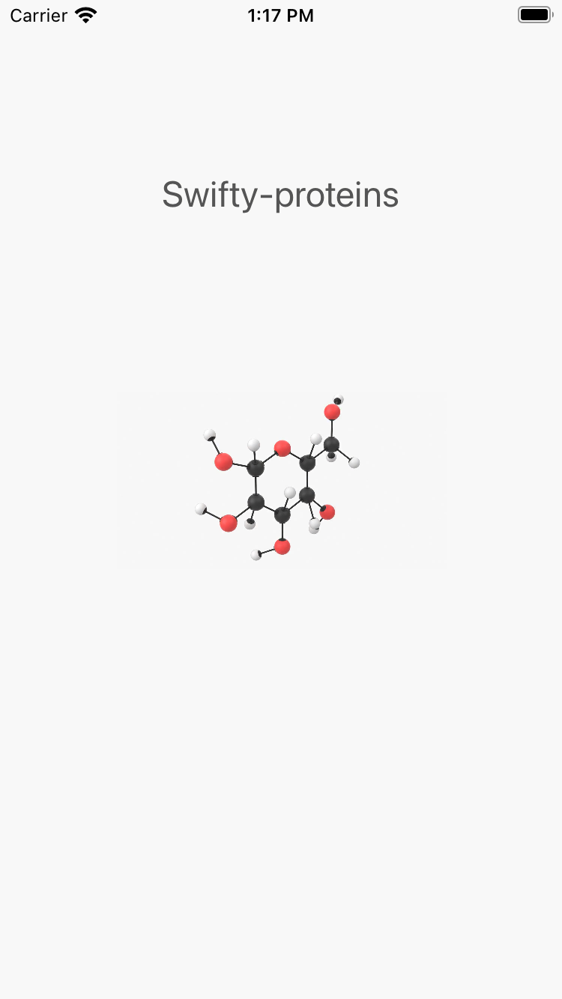
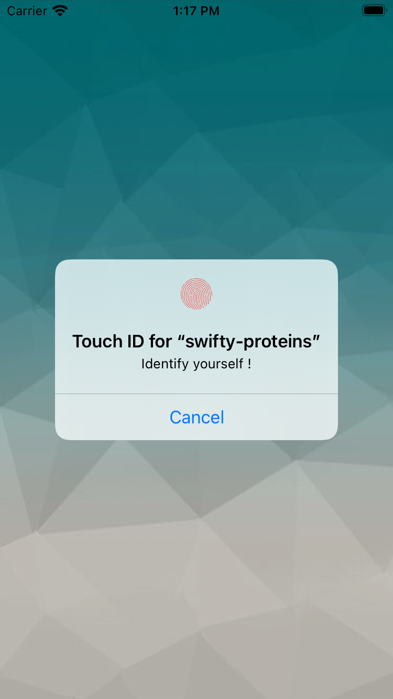
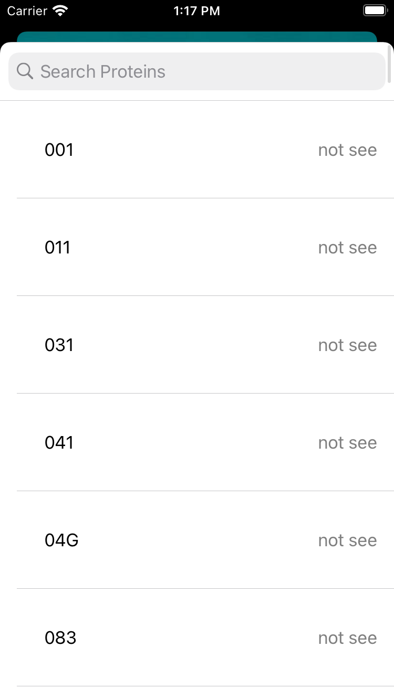
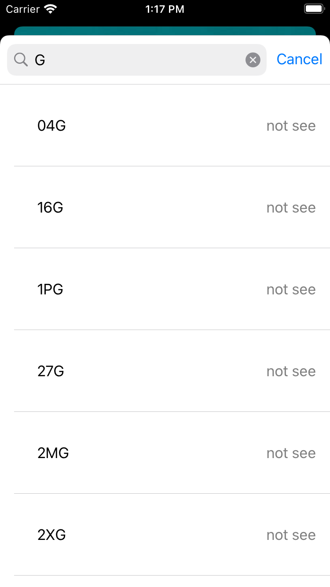
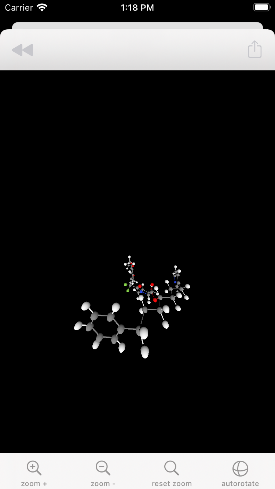
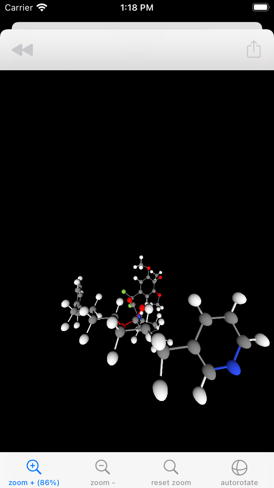
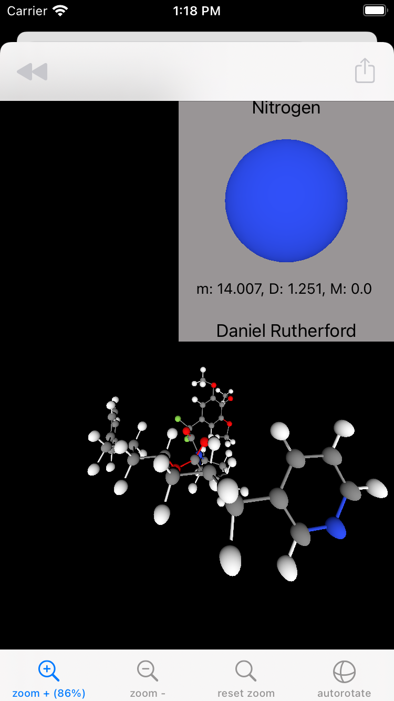

Projet :

loadPage :

HomePage :

SearchPage (1):

SearchPage (2):

ProteinPage (1):

ProteinPage (2):

ProteinPage (3):

bonus :

- custom cells
- coloration des liaisons en fonction des atomes
- preview de l'atom avec :
	- la personne qui la decouvert
	- son nom
	- sa masse molaire
	- sa masse
	- ...
- autorotate
- reset de zoom
- pourcentage de zoom
- si on a deja vu une molecule ou pas
- design
- popup customisee
- partage de la screeshot avec un message personalise
